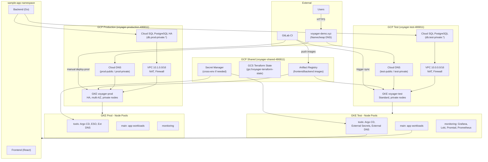

# Voyager Architecture Documentation

## Overview

This document describes the architecture of the Voyager cloud migration project, including infrastructure components, application architecture, and deployment patterns.

## Architecture Diagram

The following diagram shows key components and relationships. It can be rendered in any Mermaid-compatible viewer (e.g. GitHub, GitLab, or [Mermaid Live](https://mermaid.live)).



**Components summary:**
- **Shared:** Artifact Registry (images), GCS (Terraform state), Secret Manager.
- **Test/Prod:** VPC with private subnets and NAT; GKE (standard, private nodes); Cloud SQL (private); public and private DNS zones with TLS.
- **GKE:** Three node pools (main, tools, monitoring). Argo CD uses app-of-apps; External Secrets pulls DB credentials from Secret Manager; External DNS creates records in Cloud DNS.
- **CI/CD:** GitLab CI runs tests, builds images, pushes to shared registry; deploy-test auto, deploy-prod with manual approval; Argo CD sync can be verified so pipeline fails if sync fails.

## Cloud Provider

**Selected Provider:** [GCP / AWS / Azure]

**Rationale:**
- [Explain why this provider was chosen]
- [Reference cost analysis if applicable]

## Account/Project Structure

### Shared Account
- **Purpose:** Resources shared across environments
- **Components:**
  - Container/Artifact Registry
  - Terraform State Storage
  - Self-managed GitLab (optional)

### Test Account
- **Purpose:** Testing and development environment
- **Components:**
  - VPC and networking
  - Kubernetes cluster (standard mode)
  - Managed PostgreSQL database
  - Monitoring stack
  - Application deployments

### Production Account
- **Purpose:** Production workloads
- **Components:**
  - VPC and networking
  - Kubernetes cluster (HA, standard mode)
  - Managed PostgreSQL database (HA)
  - Monitoring stack
  - Application deployments

## Network Architecture

### VPC Design
- **CIDR Blocks:** [Specify ranges]
- **Subnets:**
  - Public subnets: [Details]
  - Private subnets: [Details]
- **NAT Gateway:** [Configuration]
- **Firewall Rules:** [Summary]

### DNS Zones
- **Public Zones:**
  - test-public.example.com
  - prod-public.example.com
- **Private Zones:**
  - test-private.example.com
  - prod-private.example.com

## Kubernetes Architecture

### Cluster Configuration
- **Mode:** Standard (NOT Autopilot/Auto Mode)
- **Control Plane:** Private (no public IP)
- **Nodes:** Private (no public IP)

### Node Pools

#### Monitoring Pool
- **Purpose:** Prometheus, Grafana, Loki, Promtail/Alloy
- **Instance Type:** [Specify]
- **Min/Max Nodes:** [Specify]
- **Zones:** [Specify]

#### Tools Pool
- **Purpose:** ArgoCD, External DNS, External Secrets
- **Instance Type:** [Specify]
- **Min/Max Nodes:** [Specify]
- **Zones:** [Specify]

#### Main Pool
- **Purpose:** Application pods (frontend, backend)
- **Instance Type:** [Specify]
- **Min/Max Nodes:** [Specify]
- **Zones:** [Specify]
- **Production:** Spread across multiple AZs

## Application Architecture

### Frontend
- **Technology:** React
- **Deployment:** Kubernetes Deployment
- **Service:** ClusterIP/NodePort
- **Ingress:** External/Internal Load Balancer
- **Namespace:** sample-app
- **Node Pool:** main

### Backend
- **Technology:** Go (Fiber framework)
- **Deployment:** Kubernetes Deployment
- **Service:** ClusterIP/NodePort
- **Ingress:** External/Internal Load Balancer
- **Namespace:** sample-app
- **Node Pool:** main
- **Database Connection:** Via External Secrets

### Database
- **Type:** Managed PostgreSQL
- **Access:** Private (no public IP)
- **High Availability:** Production only
- **Backups:**
  - Test: 7 days daily backups, 1 day PITR
  - Prod: 30 days daily backups, 7 days PITR
- **Credentials:** Stored in Secret Manager, accessed via External Secrets

## GitOps Architecture

### ArgoCD
- **Pattern:** App of Apps
- **Installation:** Terraform Helm provider
- **Node Pool:** tools
- **Access:** Via VPN/internal load balancer

### Application Definitions
- **Structure:**
  ```
  argocd/
  ├── test/
  │   └── applications/
  │       ├── templates/
  │       └── values.yaml
  └── prod/
      └── applications/
          ├── templates/
          └── values.yaml
  ```

## CI/CD Architecture

### GitLab CI Pipeline
1. **Test Stage:** Run backend tests
2. **Build Stage:** Build Docker images
3. **Push Stage:** Push to container registry
4. **Deploy Test:** Automatic on main branch
5. **Manual Approval:** Required for production
6. **Deploy Prod:** After approval

### ArgoCD Integration
- **CLI:** Installed in CI pipeline
- **Token:** Created for GitLab CI
- **Commands:** `argocd app get/diff/sync/wait`

## Monitoring Architecture

### Prometheus
- **Purpose:** Metrics collection
- **Node Pool:** monitoring
- **Exporters:**
  - Prometheus Postgres Exporter

### Loki
- **Purpose:** Log aggregation
- **Node Pool:** monitoring
- **Storage:** Cloud storage bucket

### Promtail/Grafana Alloy
- **Purpose:** Log collection
- **Node Pool:** monitoring
- **Target:** Loki

### Grafana
- **Purpose:** Visualization
- **Node Pool:** monitoring
- **Data Sources:**
  - Prometheus
  - Loki
  - Cloud provider metrics
- **Dashboards:**
  - Kubernetes cluster metrics
  - Database metrics
  - Application logs
  - Cloud provider metrics

## Security Architecture

### IAM
- **Principle:** Least privilege
- **Users:**
  - Root user (MFA, not for daily use)
  - Admin user (MFA enabled)
- **Roles:** [Specify service accounts and roles]

### Network Security
- **Private Nodes:** No public IPs
- **VPN:** Access to private resources
- **Load Balancers:** Internal for tools, external for production app
- **Firewall Rules:** [Summary]

### Secrets Management
- **Service:** Cloud provider Secret Manager
- **Access:** Via External Secrets Operator
- **Storage:** Database credentials, API keys

## Cost Optimization

### Strategies Implemented
1. **Instance Sizing:** [Details]
2. **Billing Alerts:** 25%, 50%, 75% thresholds
3. **Lifecycle Policies:** [For buckets and registries]
4. **Test Environment:** Smaller instances, no HA
5. **Resource Cleanup:** [Automation strategies]

### Estimated Costs
- **Test Environment:** [Amount/month]
- **Production Environment:** [Amount/month]
- **Shared Resources:** [Amount/month]
- **Total:** [Amount/month]

## High Availability

### Production Configuration
- **Kubernetes Control Plane:** HA (multiple zones)
- **Node Pools:** Spread across multiple AZs
- **Database:** HA configuration
- **Load Balancers:** Regional

### Test Configuration
- **Simplified:** Single zone acceptable
- **No HA:** To reduce costs

## Disaster Recovery

### Backup Strategy
- **Database:**
  - Daily backups (retention: test 7 days, prod 30 days)
  - Point-in-time recovery (retention: test 1 day, prod 7 days)
- **Application:** Git repository + container registry
- **Infrastructure:** Terraform state in cloud storage

### Rollback Process
- **Application:** Via ArgoCD (no code changes required)
- **Infrastructure:** Via Terraform

## Design Decisions

### Key Decisions
1. **Cloud Provider:** [Rationale]
2. **Kubernetes Mode:** Standard (not Autopilot) - [Rationale]
3. **Node Pools:** Three pools for separation - [Rationale]
4. **GitOps:** ArgoCD with app of apps - [Rationale]
5. **CI/CD:** GitLab CI + ArgoCD - [Rationale]
6. **Monitoring:** Prometheus + Loki + Grafana - [Rationale]

### Trade-offs
- [Document any trade-offs made]

